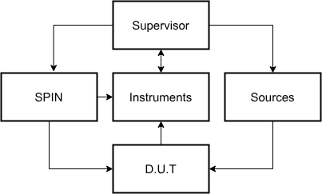
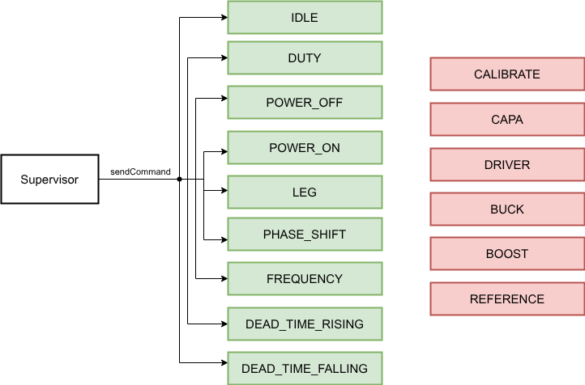
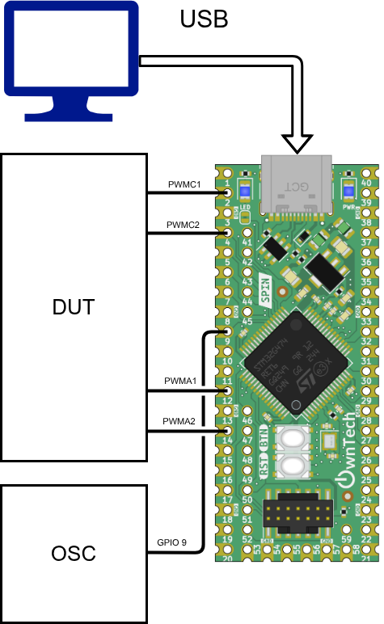
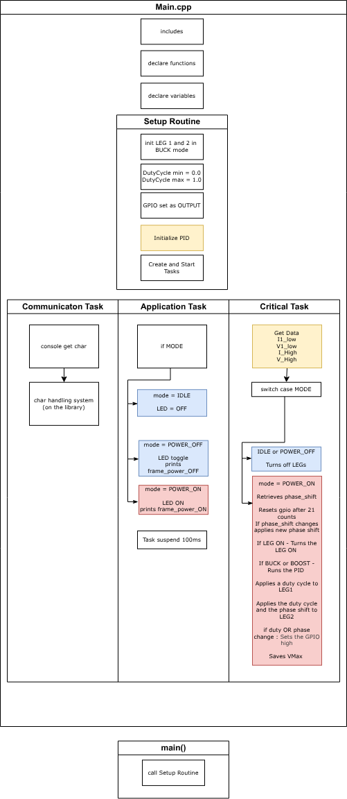
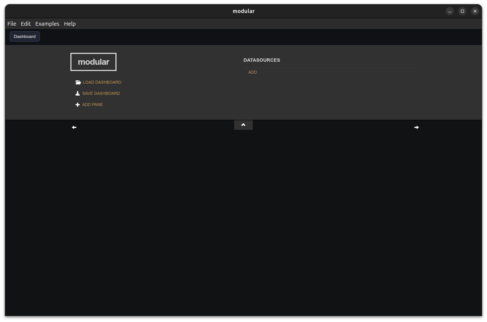
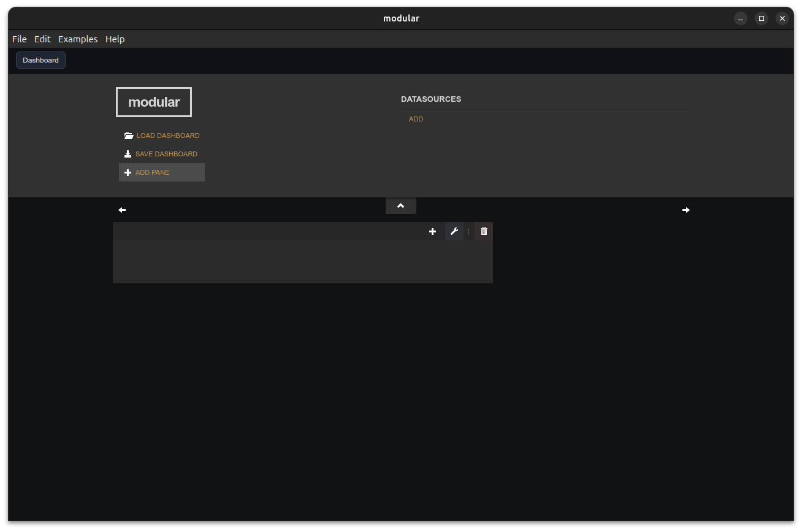
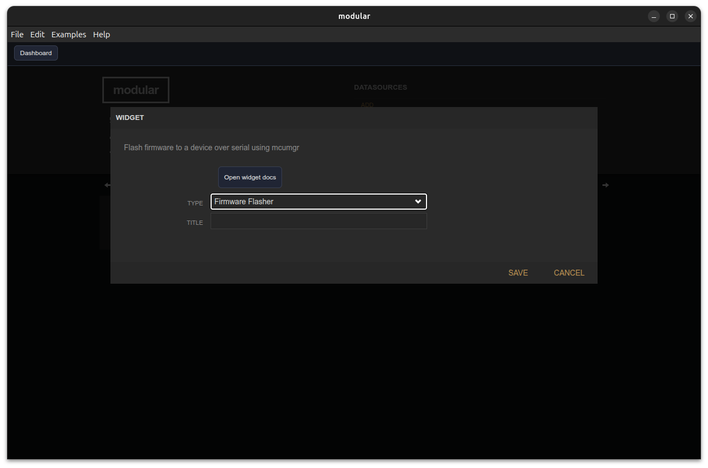
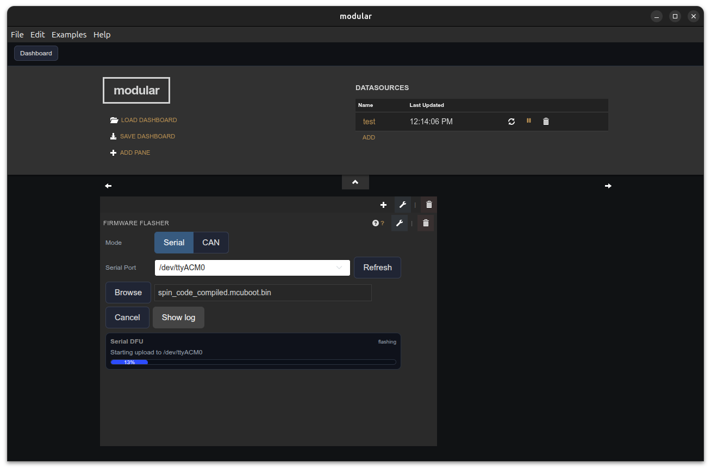

# Power Tuesday Communication Protocol

This readme explains the code that is currently updated into the SPIN board used in the Power Tuesday. 

## Functional structure of the Power Tuesday

The power tuesday project is an opposition method experimental setup, as shown in the image below. 



A supervisor will acquire measurements via instruments of a device under test (D.U.T.). The test setup is implemented via a series of commands it sends to the SPIN board and Sources.

> [!note] Important detail
> Notice that the SPIN board interfaces with the supervisor, the instruments and the D.U.T. For each of these, a different interface is shown below. 

## SPIN to Supervisor interface

The SPIN can discuss with the supervisor via a communication protocol that was developed for the `Twist` and `OwnVerter` boards. This library is automatically loaded via the `app.ini` file via the line

```
comm_protocol = https://github.com/owntech-foundation/python_twist_comm_protocol.git#power_tuesday
```

This library has two main entry points: `Shield.sendCommand` and `Shield.getMeasurement` 

In this application, the `getMeasurement` is not used by the Supervisor.

From all available commands, only the ones in green in the image below are used. 



The function is called as `Shield.sendCommand(action, *args)`.

The supported argument patterns are:

- `Shield.sendCommand("IDLE")`: No extra argument. Puts the SPIN board in idle mode and stops PWM activity.
- `Shield.sendCommand("POWER_OFF")`: No extra argument. Stops the power flow while keeping the communication active.
- `Shield.sendCommand("POWER_ON")`: No extra argument. Enables the power flow for the LEGs that were previously configured.
- `Shield.sendCommand("LEG", leg, state)`: `leg` is typically `LEG1` or `LEG2`; `state` is typically `ON` or `OFF`. Enables or disables the selected PWM leg.
- `Shield.sendCommand("CAPA", leg, state)`: Selects the capacitor path state for the chosen leg.
- `Shield.sendCommand("DRIVER", leg, state)`: Enables or disables the gate driver for the chosen leg.
- `Shield.sendCommand("BUCK", leg, state)`: Selects buck mode on the chosen leg.
- `Shield.sendCommand("BOOST", leg, state)`: Selects boost mode on the chosen leg.
- `Shield.sendCommand("DUTY", leg, value)`: Sets the PWM duty cycle of the selected leg. In `comm_script.py`, this is used as `Shield.sendCommand("DUTY", "LEG1", 0.1)`.
- `Shield.sendCommand("PHASE_SHIFT", leg, value)`: Sets the phase shift of the selected leg.
- `Shield.sendCommand("DEAD_TIME_RISING", leg, value)`: Sets the rising-edge dead time of the selected leg.
- `Shield.sendCommand("DEAD_TIME_FALLING", leg, value)`: Sets the falling-edge dead time of the selected leg.
- `Shield.sendCommand("FREQUENCY", value)`: Sets the PWM switching frequency. In `comm_script.py`, this is used as `Shield.sendCommand("FREQUENCY", 30000)`.
- `Shield.sendCommand("REFERENCE", leg, variable, value)`: Sets a reference value for a variable associated with one leg.
- `Shield.sendCommand("CALIBRATE", variable, gain, offset)`: Updates calibration coefficients for a measurement channel.


> [!note] Unseen parameters 
> Certain parameters of the Spin board are set on the `main.cpp` code and are not, for now, accessible to the Supervisor
> These paramenters include: 
>
> 

## SPIN to D.U.T. and Instruments interface

The Spin board is wired to the D.U.T. and the instruments as shown below.




The pins used are: 
- LEG 1
  - PWMA1 (pin 12)
  - PWMA2 (pin 14)
- LEG 2
  - PWMC1 (pin 2)
  - PWMC2 (pin 4)
- GPIO Trigger (pin 9)

The Structure of the code deployed in the SPIN is given below. 




> [!warning] Attention
> The blocs in yellow above are not used in this implementation, even if they are present in the code. All that is relevant to the `BUCK` and `BOOST` are present in the `POWER_ON` part of the `critical_task` but are unused. 

## Development procedure - How to change the code and re-compile

The compilation of this code can be achieved by:
- Setting up the [development environment](https://docs.owntech.org/latest/core/docs/environment_setup/) 
- Loading the python communication protocol example via the [example loading process](https://docs.owntech.org/latest/core/docs/first_example/)
- Copy-paste the `main.cpp` in the owntech folder onto the `main.cpp` of the example
- Compile and flash

## Flashing procedure

- [Download](https://github.com/owntech-foundation/modular/releases) modular from the github
- Open Modular
   
- Create a pane 
 
- Add with the `+` button the `Firmware flasher` widget
  
- Navigate to the `\owntech` folder and choose the binary
- Open the port and click on `flash`
   
